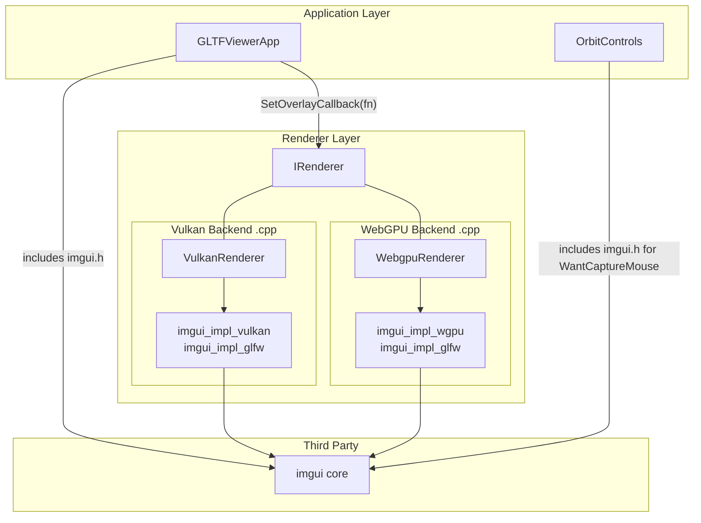
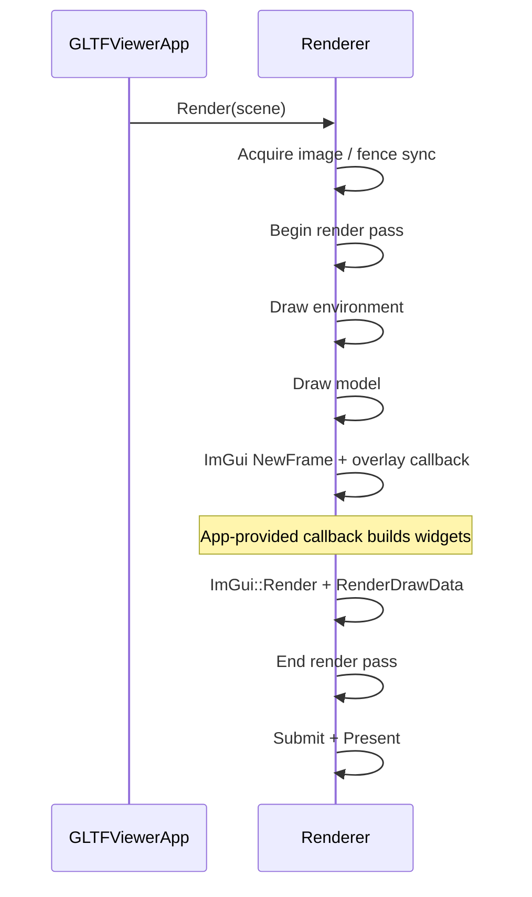

# Dear ImGui Integration Plan

## Overview

Integrate Dear ImGui with both WebGPU and Vulkan backends using ImGui's recommended pattern: backend `.cpp` files include imgui, renderer headers stay clean, app provides a UI-building callback. Designed for easy migration to a single RHI-level integration in Phase 2.

---

## Architecture

ImGui backend files (`imgui_impl_vulkan.cpp`, `imgui_impl_wgpu.cpp`) compile as part of each renderer backend library. Renderer **headers** have zero imgui includes -- only the `.cpp` implementation files do. The app provides a `std::function<void()>` callback that builds UI widgets; the renderer calls it at the right moment in the frame.

This follows ImGui's own recommended integration pattern for engines with multiple backends (see [BACKENDS.md Example B](https://github.com/ocornut/imgui/blob/master/docs/BACKENDS.md)).



### Frame Flow



Key points:

- `ImGui::NewFrame()` and the overlay callback are called **inside** `Render()`, after scene drawing but before `endRenderPass()`
- No synchronization concerns -- NewFrame is CPU-only, and RenderDrawData records into the already-active command buffer / render pass
- The renderer calls `ImGui::Render()` internally and passes draw data to the API-specific render function

---

## Phase 1 Implementation (Now)

### 1. Add Dear ImGui dependency

In `third_party/CMakeLists.txt`, add ImGui core via FetchContent. Build as a static library with core sources only (no backend files here -- those are compiled per backend).

```cmake
set(GFX_IMGUI_VERSION "v1.92.6" CACHE STRING "ImGui version" FORCE)
FetchContent_Declare(
  imgui
  GIT_REPOSITORY https://github.com/ocornut/imgui.git
  GIT_TAG ${GFX_IMGUI_VERSION}
  GIT_SHALLOW ON
)
FetchContent_MakeAvailable(imgui)

add_library(imgui STATIC
  ${imgui_SOURCE_DIR}/imgui.cpp
  ${imgui_SOURCE_DIR}/imgui_demo.cpp
  ${imgui_SOURCE_DIR}/imgui_draw.cpp
  ${imgui_SOURCE_DIR}/imgui_tables.cpp
  ${imgui_SOURCE_DIR}/imgui_widgets.cpp
  ${imgui_SOURCE_DIR}/backends/imgui_impl_glfw.cpp
)
target_include_directories(imgui PUBLIC
  ${imgui_SOURCE_DIR}
  ${imgui_SOURCE_DIR}/backends
)
target_link_libraries(imgui PUBLIC glfw)
```

### 2. Add IRenderer overlay callback

Add to `renderer/IRenderer.h` -- no imgui includes needed:

```cpp
#include <functional>

class IRenderer {
public:
    // ... existing methods ...

    using OverlayCallback = std::function<void()>;
    virtual void SetOverlayCallback(OverlayCallback callback) { (void)callback; }
};
```

### 3. Integrate into Vulkan backend

Files: `renderer/backends/vulkan/VulkanRenderer.h`, `renderer/backends/vulkan/VulkanRenderer.cpp`, `renderer/backends/vulkan/CMakeLists.txt`

**Header** -- add only the callback storage and lifecycle methods (no imgui includes):

```cpp
// VulkanRenderer.h (private section)
OverlayCallback _overlayCallback;
void InitImGui();
void ShutdownImGui();
```

**Implementation** -- `.cpp` includes imgui headers and calls the standard ImGui backend functions:

```cpp
// VulkanRenderer.cpp
#include <imgui.h>
#include <imgui_impl_glfw.h>
#include <imgui_impl_vulkan.h>
```

- `InitImGui()`: Create a dedicated descriptor pool for ImGui, call `ImGui_ImplGlfw_InitForVulkan()`, fill `ImGui_ImplVulkan_InitInfo` from existing members (`_core->GetInstance()`, `_core->GetDevice()`, `_renderPass`, etc.), call `ImGui_ImplVulkan_Init()`
- `ShutdownImGui()`: Call `ImGui_ImplVulkan_Shutdown()`, `ImGui_ImplGlfw_Shutdown()`, `ImGui::DestroyContext()`, destroy the descriptor pool
- In `Render()`: after transparent mesh drawing, before `endRenderPass()` (~line 623):

```cpp
if (_overlayCallback) {
    ImGui_ImplVulkan_NewFrame();
    ImGui_ImplGlfw_NewFrame();
    ImGui::NewFrame();
    _overlayCallback();
    ImGui::Render();
    ImGui_ImplVulkan_RenderDrawData(ImGui::GetDrawData(), *cmd);
}
```

- `SetOverlayCallback()`: Store the callback, call `InitImGui()` if not already initialized
- In destructor: call `ShutdownImGui()`

**CMakeLists.txt**: Add `imgui_impl_vulkan.cpp` to sources, link `imgui` target.

### 4. Integrate into WebGPU backend

Files: `renderer/backends/webgpu/WebgpuRenderer.h`, `renderer/backends/webgpu/WebgpuRenderer.cpp`, `renderer/backends/webgpu/CMakeLists.txt`

Same pattern as Vulkan. Key differences:

- `ImGui_ImplGlfw_InitForOther()` (not `InitForVulkan`)
- `ImGui_ImplWGPU_InitInfo` needs: `_device`, surface format, depth format
- `ImGui_ImplWGPU_RenderDrawData(ImGui::GetDrawData(), pass)` takes the `wgpu::RenderPassEncoder`
- In `Render()`: after transparent mesh drawing, before `pass.End()` (~line 534):

```cpp
if (_overlayCallback) {
    ImGui_ImplWGPU_NewFrame();
    ImGui_ImplGlfw_NewFrame();
    ImGui::NewFrame();
    _overlayCallback();
    ImGui::Render();
    ImGui_ImplWGPU_RenderDrawData(ImGui::GetDrawData(), pass);
}
```

**CMakeLists.txt**: Add `imgui_impl_wgpu.cpp` to sources, link `imgui` target. Add `IMGUI_IMPL_WEBGPU_BACKEND_DAWN` define for native builds.

### 5. Update input handling

In `application/OrbitControls.cpp`, add `#include <imgui.h>` and guard each callback:

```cpp
void OrbitControls::CursorPositionCallback(GLFWwindow* window, double xpos, double ypos) noexcept {
    if (ImGui::GetCurrentContext() && ImGui::GetIO().WantCaptureMouse) return;
    // ... existing code ...
}

void OrbitControls::ScrollCallback(...) {
    if (ImGui::GetCurrentContext() && ImGui::GetIO().WantCaptureMouse) return;
    // ... existing code ...
}

void OrbitControls::MouseButtonCallback(...) {
    if (ImGui::GetCurrentContext() && ImGui::GetIO().WantCaptureMouse) return;
    // ... existing code ...
}
```

Also in `application/Application.cpp`, guard the key callback:

```cpp
if (ImGui::GetCurrentContext() && ImGui::GetIO().WantCaptureKeyboard) return;
```

Link `imgui` to the application library in `application/CMakeLists.txt`.

### 6. Wire up in GLTFViewerApp

In `samples/gltf_viewer/GLTFViewerApp.cpp`:

```cpp
#include <imgui.h>

void GltfViewerApp::OnInit() {
    // ... existing init, after _renderer is created ...
    _renderer->SetOverlayCallback([this]() {
        ImGui::ShowDemoWindow();
    });
}
```

On backend switch (`SwitchToNextBackend()`), the old renderer is destroyed (cleaning up ImGui), and `SetOverlayCallback` on the new renderer re-initializes it.

### 7. Handle backend switching and resize

- **Backend switch**: Old renderer destructor calls `ShutdownImGui()`. New renderer's `SetOverlayCallback()` triggers `InitImGui()`. ImGui context is fully recreated.
- **Resize**: ImGui backends handle this automatically -- they query viewport size each frame via `ImGui::GetIO().DisplaySize`.
- **Emscripten**: `imgui_impl_wgpu.cpp` supports both Dawn and browser WebGPU. `imgui_impl_glfw.cpp` works with Emscripten. For Emscripten builds, also call `ImGui_ImplGlfw_InstallEmscriptenCallbacks()`.

---

## File Changes Summary

- `third_party/CMakeLists.txt` -- Add ImGui via FetchContent, build core + GLFW backend as static lib
- `renderer/IRenderer.h` -- Add `OverlayCallback` typedef and `SetOverlayCallback()` virtual
- `renderer/backends/vulkan/VulkanRenderer.h` -- Add `_overlayCallback`, `InitImGui()`, `ShutdownImGui()` (private)
- `renderer/backends/vulkan/VulkanRenderer.cpp` -- ImGui init, new-frame, render-draw-data
- `renderer/backends/vulkan/CMakeLists.txt` -- Add `imgui_impl_vulkan.cpp`, link `imgui`
- `renderer/backends/webgpu/WebgpuRenderer.h` -- Add `_overlayCallback`, `InitImGui()`, `ShutdownImGui()` (private)
- `renderer/backends/webgpu/WebgpuRenderer.cpp` -- ImGui init, new-frame, render-draw-data
- `renderer/backends/webgpu/CMakeLists.txt` -- Add `imgui_impl_wgpu.cpp`, link `imgui`, add Dawn define
- `application/OrbitControls.cpp` -- Guard callbacks with `WantCaptureMouse`
- `application/Application.cpp` -- Guard key callback with `WantCaptureKeyboard`
- `application/CMakeLists.txt` -- Link `imgui`
- `samples/gltf_viewer/GLTFViewerApp.cpp` -- Set overlay callback with demo window

---

## Phase 2 Migration (During RHI)

When the RHI abstraction is built (Phase 2b in `docs/PLAN.md`), ImGui integration migrates from per-backend to RHI-level:

### What changes

1. **Write a single `imgui_impl_rhi.cpp`** that uses the RHI API to render ImGui draw data. ImGui rendering is straightforward -- indexed textured triangles with scissor rects, alpha blending, no depth testing. This maps cleanly to any RHI.
2. **Remove `imgui_impl_vulkan` and `imgui_impl_wgpu`** from the backend libraries. The backends no longer include any imgui headers.
3. **Move ImGui init/shutdown to the application layer.** With the RHI, the application has a `rhi::Device` handle and can initialize ImGui directly -- no need for the renderer to manage it.
4. **Replace `SetOverlayCallback`** with direct ImGui calls in the app frame loop:

```cpp
void GltfViewerApp::OnFrame(float dt) {
    ImGui_ImplRhi_NewFrame();
    ImGui_ImplGlfw_NewFrame();
    ImGui::NewFrame();

    // Build UI
    ImGui::ShowDemoWindow();
    ImGui::Render();

    _renderer->Render(model, camera);

    // Render ImGui as a separate RHI pass (or injected via RHI command list)
    ImGui_ImplRhi_RenderDrawData(ImGui::GetDrawData(), rhiCommandBuffer);

    _renderer->Present();
}
```

### Why Phase 1 migrates cleanly

- The overlay callback pattern keeps ImGui usage in the app layer to a minimum -- only the callback lambda and `SetOverlayCallback` call need updating
- ImGui's core (context, widget building, draw data) is backend-agnostic and unchanged
- The RHI refactor already replaces all backend-specific code, so removing `imgui_impl_vulkan`/`imgui_impl_wgpu` from backend libs is a natural part of that work

---

## Testing Verification

1. Run `gltf_viewer` with Vulkan -- ImGui demo window appears, is interactive
2. Run `gltf_viewer` with WebGPU -- same behavior
3. Press B to switch backends -- ImGui reinitializes correctly
4. Click/drag ImGui windows -- model does not rotate (input gating works)
5. Resize window -- ImGui and scene both resize correctly
6. Web build (Emscripten) -- demo window works in browser
